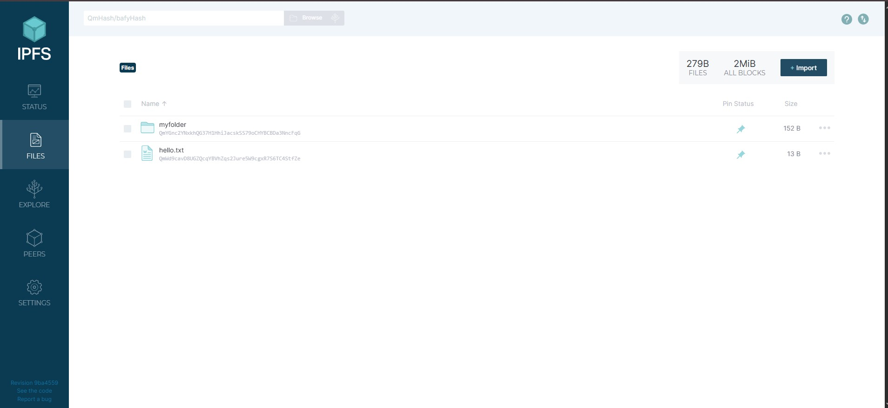
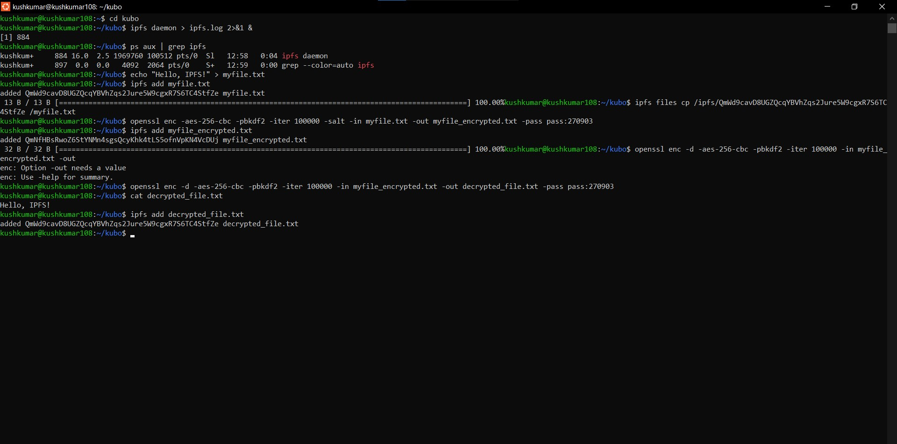
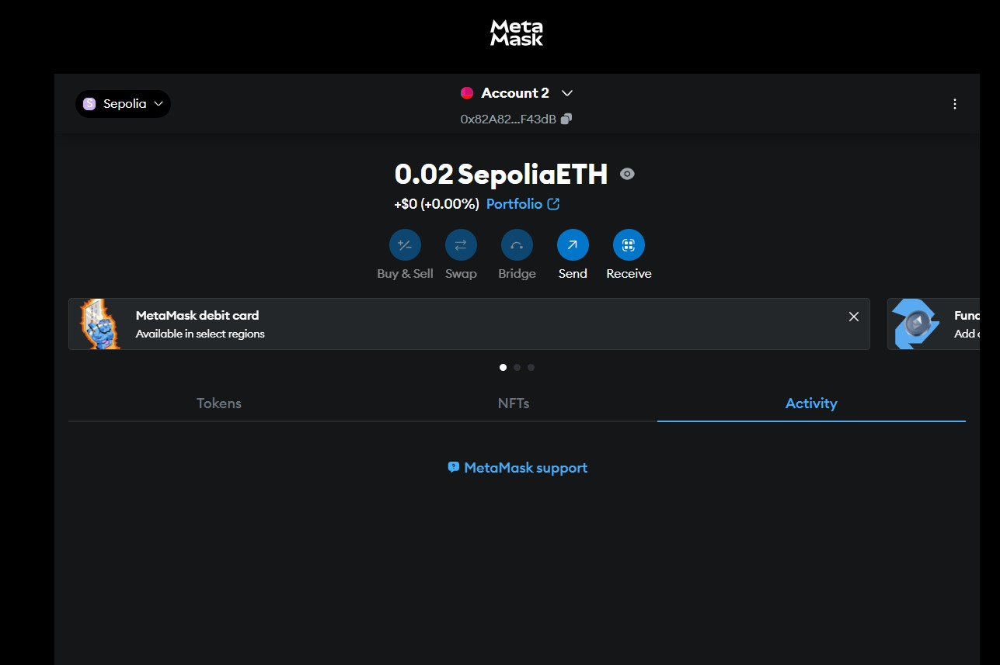

# Blockchain

## Hyperledger Fabric test network

---

## 1. Install Go (Golang)

Golang is a required dependency for running Hyperledger Fabric.

```bash
sudo apt install golang-go
```

---

## 2. Check Docker Installation

Docker is needed to run Fabric components as containers. Verify it's installed:

```bash
docker --version
```

---

## 3. Check Docker Compose Installation

Docker Compose is used to manage multi-container applications like Fabric.

```bash
docker-compose --version
```

---

## 4. List the Files in the Current Directory

Just to verify where you are.

```bash
ls
```

---

## 5. Clone the Hyperledger Fabric Samples Repository

This repository contains example configurations and network setups.

```bash
git clone -b main https://github.com/hyperledger/fabric-samples.git
```

---

## 6. Change into the Fabric Samples Directory

Move into the directory you just cloned.

```bash
cd fabric-samples
```

---

## 7. Download the Binaries and Docker Images

This command fetches the necessary binaries and Docker images for Fabric.

```bash
curl -sSL https://bit.ly/2ysbOFE | bash -s
```

---

## 8. Navigate to the Test Network Directory

This directory contains scripts to bring up a sample Fabric network.

```bash
cd test-network
```


---

## 9.

```bash
./network.sh
```

---

## 10. start the Test Network

This will start a basic Fabric network with two organizations and their peers.

```bash
./network.sh up
```

---

## 11. Create a Channel

Once the network is up, create a channel to allow communication between peers.

```bash
./network.sh createChannel
```

---

## 12. Shut Down the Network

When  done, tear down the running network to free resources.

```bash
./network.sh down
```

---
# Assignment 
Installation of IPFS on local machine. Further, upload the files (such as photos, audio, and video) on IPFS and share it with other through content identifier (i.e., hash). Perform assessment using ubuntu WSL.


## Step 1: Install IPFS on Ubuntu WSL

1. Download IPFS:
   ```
   wget https://dist.ipfs.tech/kubo/v0.34.1/kubo_v0.34.1_linux-amd64.tar.gz
   ```

2. Extract the archive:
   ```
   tar -xvzf kubo_v0.34.1_linux-amd64.tar.gz
   ```

3. Change directory:
   ```
   cd kubo
   ```

4. Install IPFS:
   ```
   sudo bash install.sh
   ```

5. Check IPFS version:
   ```
   ipfs --version
   ```

6. Initialize IPFS:
   ```
   ipfs init
   ```

7. Start IPFS daemon in the background:
   ```
   ipfs daemon > ipfs.log 2>&1 &
   ```

8. Confirm daemon is running:
   ```
   ps aux | grep ipfs
   ```


## Step 2: Upload Files to IPFS

1. TEXT file  hello.txt.
   ```
   Add file: echo "Hello, IPFS!" > hello.txt
   ```
2. add 
   ```
   ipfs add hello.txt
   ```

3. to see on IPFS
   ```
   ipfs files cp /ipfs/QmWd9cavD8UGZQcqYBVhZqs2Jure5W9cgxR7S6TC4StfZe /hello.txt
   ```
4. To see your file using content id.
   ```
   ipfs cat <CID>
   ```
   

5. Add a directory:
   ```
   mkdir myfolder
   echo "File 1 content" > myfolder/file1.txt
   echo "File 2 content" > myfolder/file2.txt
    ipfs add -r myfolder
   ipfs files cp /ipfs/QmYGnc2YNxkhQG37H1HhiJacskSS79oCHYBCBDa3NncFqG /myfolder
   ```
   
    

6. Upload a sample video:
   ```
   ipfs add sample.mp4
    ipfs files cp /ipfs/<CID>/sample.mp4
   ```
     

7. Output after upload:
   ```
   added <CID> sample.mp4
   ```
   
## Step 3: Share File using CID

The video file can be shared with others using the following IPFS link:
   


Anyone with the link can view or download the video directly from the IPFS network.

## Step 4: To stop it, simply run:

   ```
  kill <PID>
   ```
  Then, to confirm it stopped:
 ```
  ps aux | grep ipfs
   ```
# Assignment 5: IPFS Privacy and Encryption

This assignment demonstrates how to use the InterPlanetary File System (IPFS) along with OpenSSL to perform file encryption and ensure privacy via the command line.

## Steps

1. **Create a file to be added to IPFS**
   ```bash
   echo "Hello, IPFS!" > myfile.txt
   ```

2. **Add the original file to IPFS**
   ```bash
   ipfs add myfile.txt
   ```
   
3. **Encrypt the file using OpenSSL (AES-256-CBC)**
   ```bash
   openssl enc -aes-256-cbc -pbkdf2 -iter 100000 -salt -in myfile.txt -out myfile_encrypted.txt -pass pass:yourpassword
   ```

4. **Add the encrypted file to IPFS**
   ```bash
   ipfs add myfile_encrypted.txt
   ```


5. **View the encrypted file (optional)**
   ```bash
   cat myfile_encrypted.txt
   ```

6. **Decrypt the file**
   ```bash
   openssl enc -d -aes-256-cbc -pbkdf2 -iter 100000 -in myfile_encrypted.txt -out decrypted_file.txt -pass pass:yourpassword
   ```

7. **Verify the decrypted file content**
   ```bash
   cat decrypted_file.txt
   ```

8. **Add the decrypted file to IPFS**
   ```bash
   ipfs add decrypted_file.txt
   ```
   
   
## Notes

- Replace `yourpassword` with a strong, secure password of your choice.
- Ensure that IPFS is properly installed and initialized before running these commands.

---
# 🔁 Web3 Wallet Transfer Test (SepoliaETH + MetaMask)

This mini project demonstrates how to send **SepoliaETH** from one MetaMask wallet to another using the **Sepolia testnet**, ideal for testing Ethereum-based blockchain interactions without spending real ETH.

---

## 📦 What’s Inside

- ✅ MetaMask setup and testnet config
- ✅ Claimed 0.05 SepoliaETH from faucet
- ✅ Transferred 0.02 SepoliaETH to another MetaMask wallet
- ✅ Verified successful transfer via MetaMask & Sepolia Etherscan

---

## 🧪 Getting Started

### 1. 🔐 Install MetaMask and account created 
[Download MetaMask](https://metamask.io/) as a browser extension or mobile app and create two separate wallets.


### 2. 🌐 Enable Sepolia Test Network
- Click the MetaMask network dropdown > **Show Test Networks**
- Toggle ON in settings (Settings > Advanced > Show Test Networks)
- Select **Sepolia** from the network list


### 3. 💸 Get SepoliaETH
Use a Sepolia faucet like:

- [Alchemy Sepolia Faucet](https://sepoliafaucet.com/)
- [Google Cloud Sepolia Faucet](https://faucet.quicknode.com/ethereum/sepolia)

Paste your **first wallet address** to receive **free test ETH**.


### 4. 🚀 Send ETH from Wallet 1 → Wallet 2


1. In MetaMask, switch to your **Wallet 1**
2. Click **Send**
3. Paste **Wallet 2** address


4. Enter amount (e.g., `0.02`)
5. Confirm and wait for the transaction


### 5. 🧾 Verify Transfer

- Open **Wallet 2** in MetaMask (make sure it's also on Sepolia)
- View the balance update



