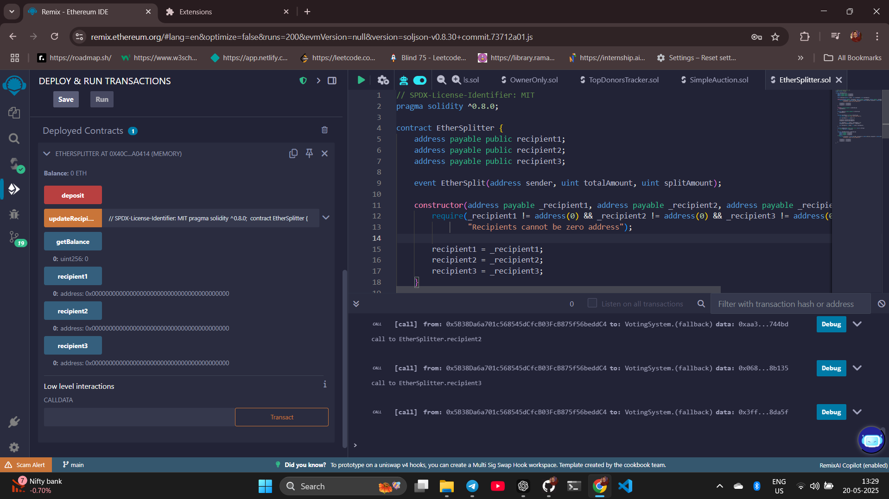
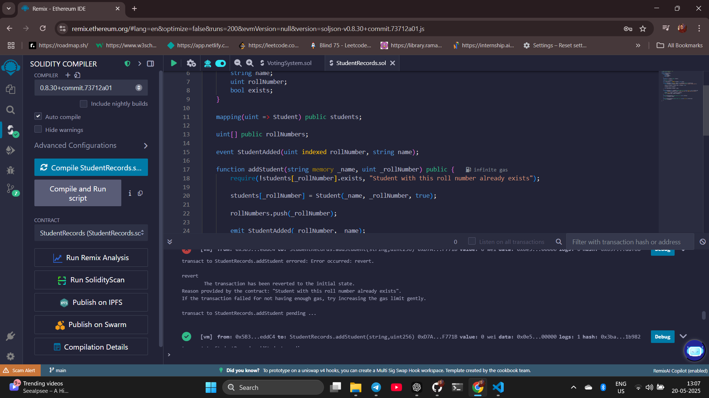
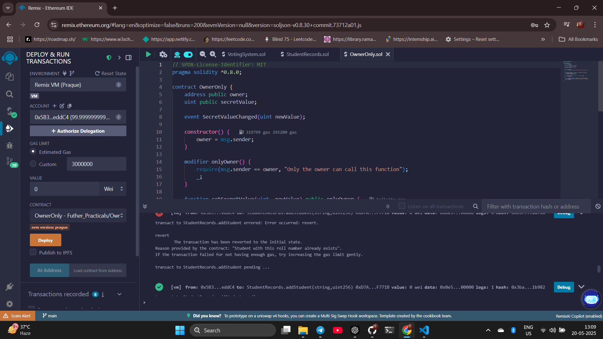
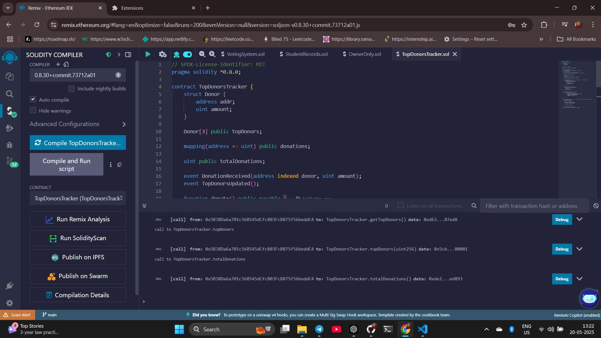
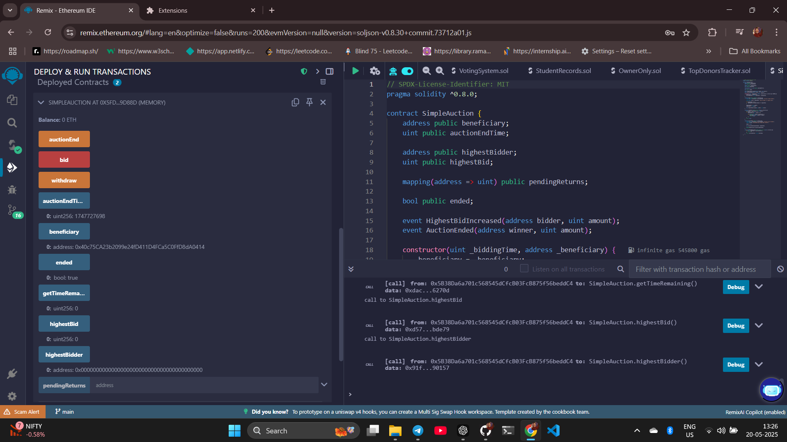

# Further Practicals - Smart Contracts Collection

This directory contains a collection of Solidity smart contracts demonstrating various blockchain concepts and use cases.

## Table of Contents

1. [Ether Splitter](#1-ether-splitter)
2. [Voting System](#2-voting-system)
3. [Student Records](#3-student-records)
4. [Owner Only Function](#4-owner-only-function)
5. [Top Donors Tracker](#5-top-donors-tracker)
6. [Simple Auction](#6-simple-auction)

## 1. Ether Splitter

**Location**: [`Ether_Splitter/EtherSplitter.sol`](Ether_Splitter/EtherSplitter.sol)



A smart contract that automatically splits incoming Ether between three recipients.

**Features**:

- Automatic splitting of received Ether
- Configurable recipient addresses
- Secure fund distribution

**Key Functions**:

```solidity
function deposit() public payable
function updateRecipients(address payable _recipient1, address payable _recipient2, address payable _recipient3) public
```

## 2. Voting System

**Location**: [`Voting_system/VotingSystem.sol`](Voting_system/VotingSystem.sol)


A decentralized voting system with anti-fraud measures.

**Features**:

- One vote per address
- Multiple candidate support
- Real-time vote counting

**Key Functions**:

```solidity
function vote(uint _candidateId) public
function getCandidate(uint _candidateId) public view returns (uint, string memory, uint)
```

## 3. Student Records

**Location**: [`Student_Records/StudentRecords.sol`](Student_Records/StudentRecords.sol)



Educational record management system on blockchain.

**Features**:

- Immutable student records
- Verification system
- Easy data retrieval

**Key Functions**:

```solidity
function addStudent(string memory _name, uint _rollNumber) public
function getStudent(uint _rollNumber) public view returns (string memory, uint)
```

## 4. Owner Only Function

**Location**: [`Owner_only_Function/OwnerOnly.sol`](Owner_only_Function/OwnerOnly.sol)



Demonstrates access control in smart contracts.

**Features**:

- Owner-restricted functions
- Ownership transfer capability
- Secure value management

**Key Functions**:

```solidity
function setSecretValue(uint _newValue) public onlyOwner
function transferOwnership(address _newOwner) public onlyOwner
```

## 5. Top Donors Tracker

**Location**: [`Top_Donors_Tracker/TopDonorsTracker.sol`](Top_Donors_Tracker/TopDonorsTracker.sol)



Tracks and ranks the top three donors to a contract.

**Features**:

- Automatic ranking system
- Donation history tracking
- Real-time leaderboard

**Key Functions**:

```solidity
function donate() public payable
function getTopDonors() public view returns (address[3] memory, uint[3] memory)
```

## 6. Simple Auction

**Location**: [`Simple_auction/SimpleAuction.sol`](Simple_auction/SimpleAuction.sol)



Time-limited auction system with automated winner selection.

**Features**:

- Timed bidding process
- Automatic highest bid tracking
- Secure fund management

**Key Functions**:

```solidity
function bid() public payable
function withdraw() public returns (bool)
function auctionEnd() public
```

## Development Environment

- **Solidity Version**: ^0.8.0
- **IDE**: Remix IDE
- **Network**: Sepolia Testnet
- **Tools**: MetaMask, Web3.js/Ethers.js

## How to Use These Contracts

1. **Setup**:

   - Install MetaMask
   - Connect to Sepolia Testnet
   - Get test ETH from a faucet

2. **Deployment**:

   - Open contract in Remix IDE
   - Compile using Solidity ^0.8.0
   - Deploy using MetaMask
   - Save contract address

3. **Testing**:

   - Use Remix IDE's interface
   - Test all functions
   - Verify on Sepolia Explorer

4. **Interaction Examples**:

   ```javascript
   // Deploy Voting System
   const votingSystem = await VotingSystem.deploy([
     "Candidate A",
     "Candidate B",
   ]);
   await votingSystem.vote(1);

   // Deploy Ether Splitter
   const splitter = await EtherSplitter.deploy(addr1, addr2, addr3);
   await splitter.deposit({ value: ethers.utils.parseEther("1.0") });
   ```

## Screenshots

All implementation screenshots are available in the [`all_screenshots`](all_screenshots/) directory.
