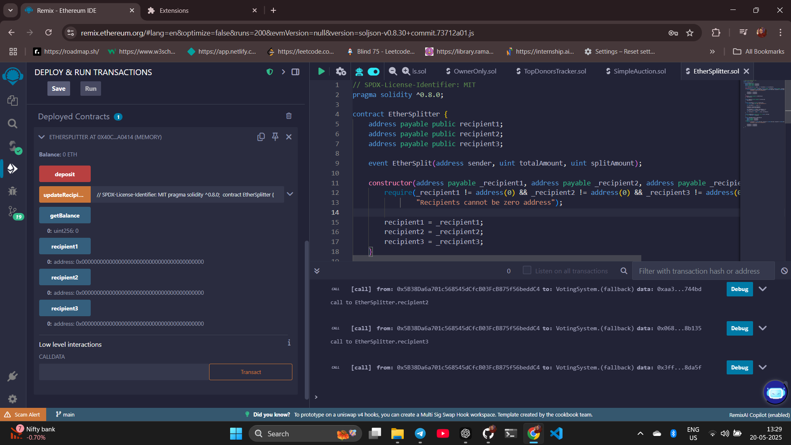
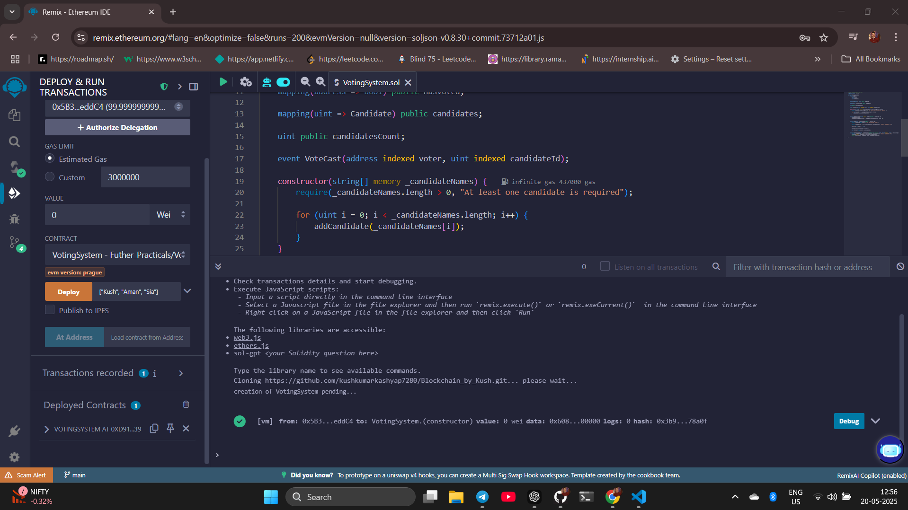
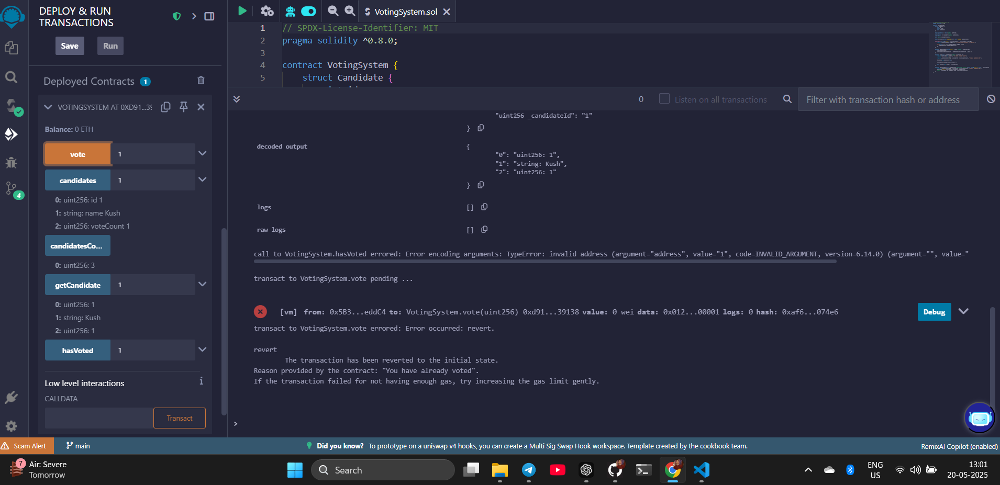
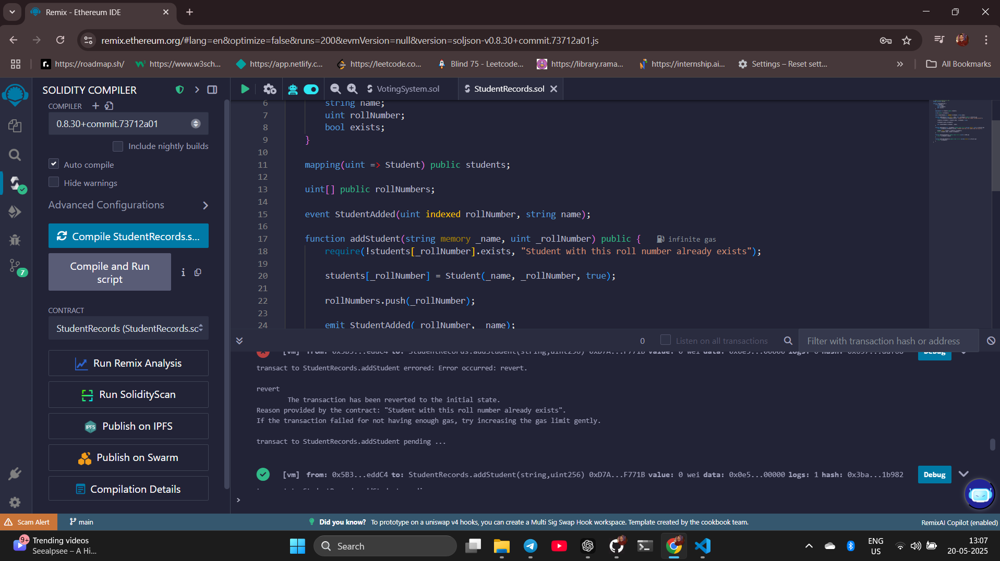
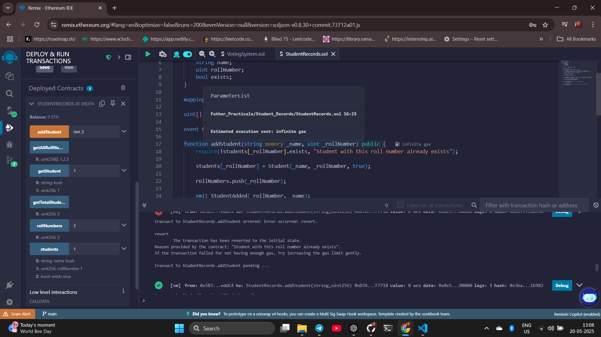
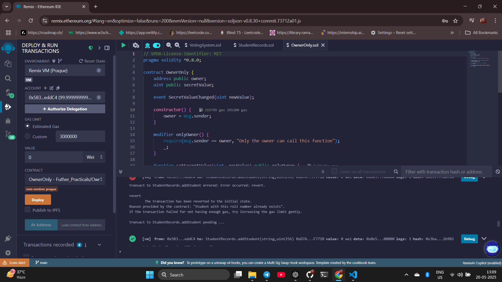
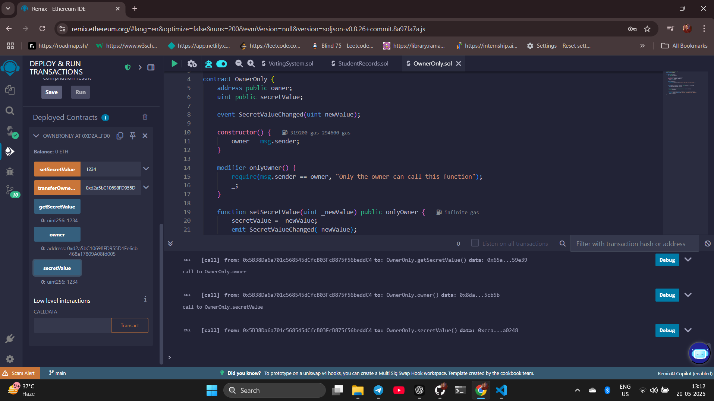
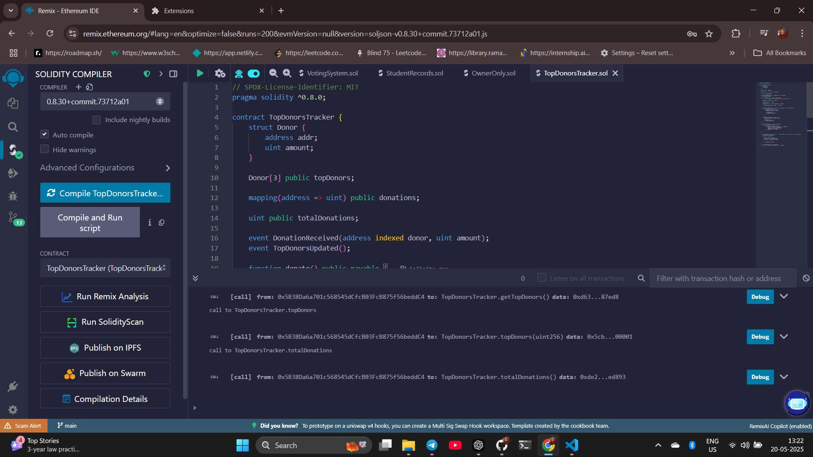
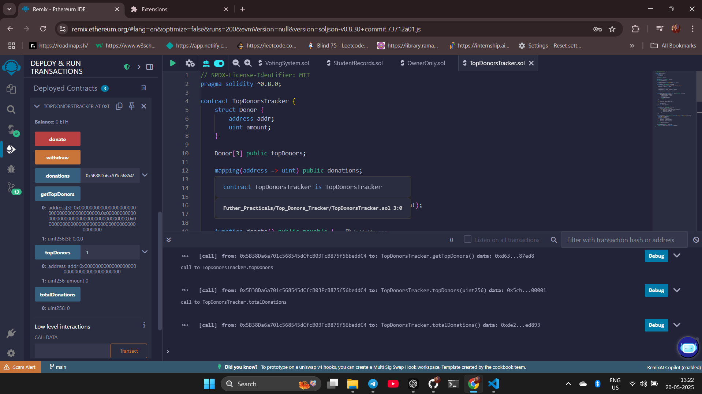
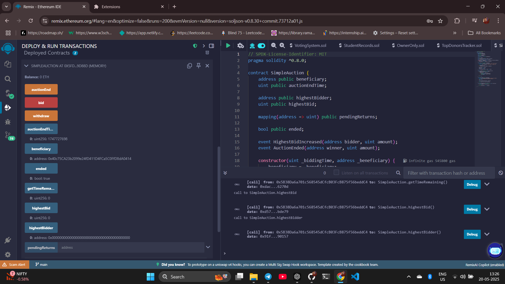

# Blockchain by Kush

This repository contains a collection of blockchain-related projects and practical exercises, divided into two main sections:

## Table of Contents

- [First 5 Practicals](First_5_Practicals/README.md)
- [Smart Contracts](Smart_contracts/README.md)

## First 5 Practicals

The `First_5_Practicals` directory contains foundational blockchain exercises focused on:

1. **Hyperledger Fabric Test Network Setup**

   - Installation and configuration of Go, Docker, and Docker Compose
   - Cloning and setting up the Hyperledger Fabric Samples repository
   - Starting a test network, creating channels, and shutting down the network

2. **IPFS Implementation**

   - Installation of InterPlanetary File System (IPFS) on Ubuntu WSL
   - Uploading different file types (text, images, audio, video) to IPFS
   - Sharing content through content identifiers (CIDs)
   - Creating and managing directories on IPFS

3. **File Encryption**

   - Using OpenSSL for file encryption with AES-256-CBC
   - Implementing secure encryption practices
   - Decryption of encrypted files

4. **MetaMask Wallet Setup**
   - Creating and configuring MetaMask profiles
   - Connecting to test networks (Sepolia)
   - Obtaining test tokens from faucets
   - Sending and receiving transactions between accounts

### How to Use

1. **For Hyperledger Fabric:**

   ```bash
   # Navigate to the fabric-samples/test-network directory
   cd fabric-samples/test-network

   # Start the network
   ./network.sh up

   # Create a channel
   ./network.sh createChannel

   # Shut down when done
   ./network.sh down
   ```

2. **For IPFS:**

   ```bash
   # Initialize IPFS
   ipfs init

   # Start IPFS daemon
   ipfs daemon

   # Add files to IPFS
   ipfs add <filename>

   # View files using their CID
   ipfs cat <CID>
   ```

3. **For File Encryption:**

   ```bash
   # Encrypt a file
   openssl enc -aes-256-cbc -pbkdf2 -iter 100000 -salt -in myfile.txt -out myfile_encrypted.txt -pass pass:yourpassword

   # Decrypt a file
   openssl enc -d -aes-256-cbc -pbkdf2 -iter 100000 -in myfile_encrypted.txt -out myfile_decrypted.txt -pass pass:yourpassword
   ```

## Further Practicals

The `Smart_contracts` directory contains more advanced Solidity smart contracts for Ethereum blockchain applications. Each contract has been implemented, compiled, and tested using Remix IDE.

### 1. **Ether Splitter (`Ether_Splitter/EtherSplitter.sol`)**

- A contract that automatically splits incoming Ether between three recipients
- Features include deposit function, automatic splitting, and recipient management
- Use case: Automatic revenue sharing or payment distribution systems



**Key Functions:**

```solidity
// Receive and split Ether between three recipients
function deposit() public payable

// Update recipient addresses
function updateRecipients(address payable _recipient1, address payable _recipient2, address payable _recipient3) public
```

### 2. **Voting System (`Voting_system/VotingSystem.sol`)**

- A decentralized voting system that tracks candidates and votes
- Prevents double voting through address tracking
- Use case: Transparent and tamper-proof elections or decision-making processes




**Key Functions:**

```solidity
// Cast a vote for a candidate
function vote(uint _candidateId) public

// Get candidate information
function getCandidate(uint _candidateId) public view returns (uint, string memory, uint)
```

### 3. **Student Records (`Student_Records/StudentRecords.sol`)**

- Manages student information on the blockchain
- Stores student names and roll numbers with existence verification
- Use case: Educational record management with immutable history




**Key Functions:**

```solidity
// Add a new student to the records
function addStudent(string memory _name, uint _rollNumber) public

// Retrieve student information
function getStudent(uint _rollNumber) public view returns (string memory, uint)
```

### 4. **Owner Only Function (`Owner_only_Function/OwnerOnly.sol`)**

- Demonstrates access control using the `onlyOwner` modifier
- Allows only the contract owner to modify a secret value
- Use case: Administrative control in decentralized applications




**Key Functions:**

```solidity
// Set a secret value (only owner can call)
function setSecretValue(uint _newValue) public onlyOwner

// Transfer ownership to a new address
function transferOwnership(address _newOwner) public onlyOwner
```

### 5. **Top Donors Tracker (`Top_Donors_Tracker/TopDonorsTracker.sol`)**

- Tracks and sorts the top three donors to a contract
- Maintains donation history and total donations
- Use case: Charity organizations or fundraising campaigns with recognition features




**Key Functions:**

```solidity
// Make a donation to the contract
function donate() public payable

// Get the top three donors
function getTopDonors() public view returns (address[3] memory, uint[3] memory)
```

### 6. **Simple Auction (`Simple_auction/SimpleAuction.sol`)**

- Implements a time-limited auction system
- Handles bidding, fund management, and auction completion
- Use case: Decentralized auction platforms or NFT sales



**Key Functions:**

```solidity
// Place a bid in the auction
function bid() public payable

// Withdraw funds if outbid
function withdraw() public returns (bool)

// End the auction and transfer funds to beneficiary
function auctionEnd() public
```

### How to Use the Solidity Contracts

1. **Deployment:**

   - These contracts can be deployed on Ethereum testnets (Sepolia, Goerli) or local development networks
   - Use tools like Remix IDE, Truffle, or Hardhat for deployment

2. **Interaction:**

   - After deployment, interact with the contracts using web3.js, ethers.js, or through wallet interfaces like MetaMask
   - Each contract has specific functions for its intended use case

3. **Example for Voting System:**

   ```javascript
   // Deploy with candidate names
   const votingSystem = await VotingSystem.deploy([
     "Candidate A",
     "Candidate B",
     "Candidate C",
   ]);

   // Cast a vote for candidate ID 2
   await votingSystem.vote(2);

   // Get candidate information
   const candidateInfo = await votingSystem.getCandidate(2);
   ```

4. **Example for Ether Splitter:**

   ```javascript
   // Deploy with three recipient addresses
   const etherSplitter = await EtherSplitter.deploy(
     recipient1,
     recipient2,
     recipient3
   );

   // Send Ether to be split
   await etherSplitter.deposit({ value: ethers.utils.parseEther("1.0") });
   ```

## Development Environment

- Solidity: ^0.8.0
- Ethereum Development: Remix IDE, MetaMask
- Hyperledger Fabric: v2.x
- IPFS: Kubo implementation
- Testing Networks: Sepolia Testnet
